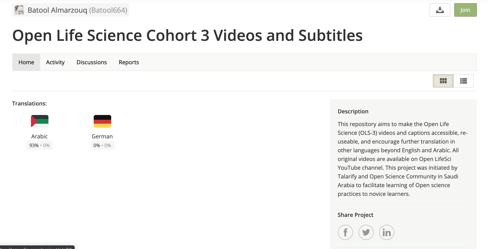
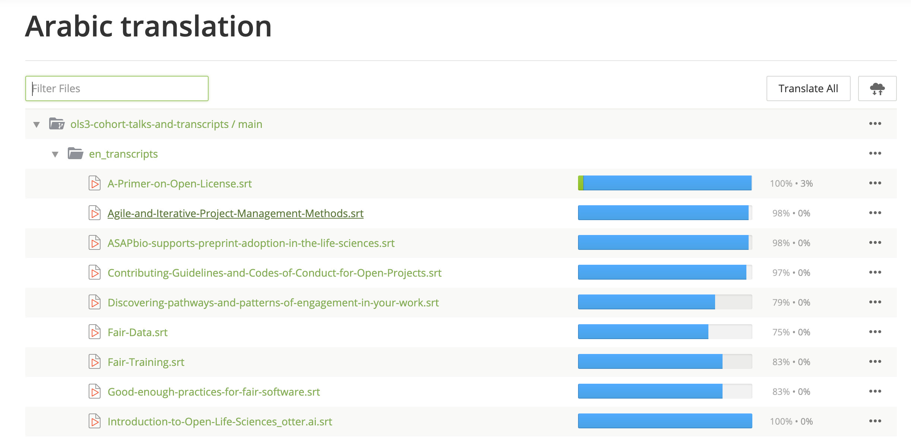

# Contributing

:+1::tada: First of all, thanks for taking the time to contribute! :tada::+1:

By contributing,
you agree that we may redistribute your work under [our license](LICENSE.md).
Everyone involved in this project
agrees to abide by our [code of conduct](CODE_OF_CONDUCT.md).

We welcome all contributions to this project. There are many ways to contribute to this project without knowing git/GitHub. We use Crowdin, which is a localisation management platform that integrates seamlessly with GitHub and leverages an existing Translation Memory and Glossary. You can explore [Crowdin](#using-crowdin) in the next section. 

- You are encouraged to make changes to existing translation or review and approve previous translations. As we mentioned, we use Crowdin, which means you don't need to use git/Github to start. You can click on the checkmark to approve a translation!


- We welcome any addition of new languages. You can also ask to add a new language by opening an issue in this repository, commenting in Crowdin or emailing us at batool@liverpool.ac.uk.

- We realise that our transcript, which was generated by otter.ai and manually cleaned, isn't perfect. We very much welcome corrections to the transcript through opening an issue or submitting a PR.

- At the moment, the adjusted transcripts are uploaded manually from GitHub to YouTube. Help us to build a CI to integrate YouTube with GitHub and improve the workflow of this project.

- This repository only contains the videos for OLS3. Help us to improve the repository of [OLS2](https://github.com/open-life-science/ols2-cohort-talks-and-transcripts) and [OLS1](https://github.com/open-life-science/ols1-cohort-talks-and-transcripts).

- If you find any typo, don't hesitate to open an issue.

## Using Crowdin

- You can access Crowdin through [this link](https://crowdin.com/project/ols3). The main page displays the languages which are being translated.



If you clicked on the target language, you can choose the transcript which you want to contribute to.



- In the crowdin editor, you can translate subtitles while watching the video play. As you are translating, the subtitles are synchronised with the video while it plays, and the subtitles are highlighted accordingly. When you begin typing a translation, the video automatically pauses, giving you time to translate the subtitle.


- You can create a glossary and translation memory for Open Science terms easily.


> **Any string translated in Crowdin will trigger a PR in this repository automatically. It will then be reviwed by the maintainers!** 

## Using GitHub

**Another way of contributing to this repository is using GitHub. If you haven't worked with GitHub and needs any help, please contact batool@liverpool.ac.uk**

1. Check that there isn't [already an issue](https://github.com/open-life-science/ols3-cohort-talks-and-transcripts/issues) about your idea to avoid duplicating work.
    * If there isn't one already, please create one so that others know you're working on this

2. Fork the [open-life-science/ols3-cohort-talks-and-transcripts](https://github.com/open-life-science/ols3-cohort-talks-and-transcripts) to your GitHub account.

3. Clone the forked repository on your local machine.

 ```bash
 
 git clone https://github.com/<your-local-repo>/ols3-cohort-talks-and-transcripts.git
 
 ```
4. Sync the fork, to avoid merge conflicts. 

```bash

    git remote add upstream https://github.com/open-life-science/ols3-cohort-talks-and-transcripts.git
    git fetch upstream
    git pull upstream master
    git push
    
```

5. Create a new branch with your GitHub username as its name.

 ```bash
 
    git checkout -b <your-github-username>
    
 ```

6. Make the necessary changes / additions within your forked repository.

7. Add and commit changes made.

 ```bash
 
    git add .
    git commit -m "commit message"
    
 ```
8. Push the changes to the forked repository.

 ```bash
 
    git push origin <branch-name>
    
 ```

9. Submit a Pull Request against the `master` branch and wait for the code to be reviewed and merged.

If you're not used to this workflow with git, you can start with some [basic docs from GitHub](https://help.github.com/articles/fork-a-repo/).

**Maintainers will do their best to help you if you have any questions, concerns, or experience any difficulties along the way.**

